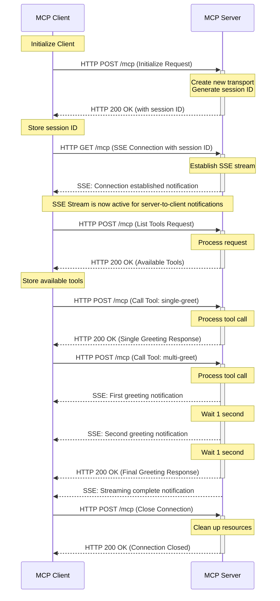

# Client-Server Interaction Diagram (Mermaid)

This diagram illustrates the detailed interaction between the client and server in the MCP (Model Context Protocol) implementation.

## Sequence Diagram



## Technical Implementation Details

### Client Implementation

The client is implemented in TypeScript and uses the MCP SDK:

```typescript
// Key client components
class MCPClient {
    // Connect to server
    async connectToServer(serverUrl: string) {
        this.transport = new StreamableHTTPClientTransport(url)
        await this.client.connect(this.transport)
        this.setUpTransport()
        this.setUpNotifications()
    }
    
    // List available tools
    async listTools() {
        const toolsResult = await this.client.listTools()
        this.tools = toolsResult.tools.map(...)
    }
    
    // Call a tool
    async callTool(name: string) {
        const result = await this.client.callTool({
            name: name,
            arguments: { name: "itsuki" },
        })
        // Process result...
    }
    
    // Set up notification handlers
    private setUpNotifications() {
        this.client.setNotificationHandler(LoggingMessageNotificationSchema, ...)
        this.client.setNotificationHandler(ToolListChangedNotificationSchema, ...)
    }
}
```

### Server Implementation

The server is implemented in TypeScript using Express.js and the MCP SDK:

```typescript
// Key server components
class MCPServer {
    // Handle POST requests (regular communication)
    async handlePostRequest(req: Request, res: Response) {
        const sessionId = req.headers[SESSION_ID_HEADER_NAME]
        
        // Reuse existing transport
        if (sessionId && this.transports[sessionId]) {
            transport = this.transports[sessionId]
            await transport.handleRequest(req, res, req.body)
            return
        }
        
        // Create new transport for initialization
        if (!sessionId && this.isInitializeRequest(req.body)) {
            const transport = new StreamableHTTPServerTransport({
                sessionIdGenerator: () => randomUUID(),
            })
            await this.server.connect(transport)
            await transport.handleRequest(req, res, req.body)
            
            const sessionId = transport.sessionId
            if (sessionId) {
                this.transports[sessionId] = transport
            }
            return
        }
    }
    
    // Handle GET requests (SSE streams)
    async handleGetRequest(req: Request, res: Response) {
        const sessionId = req.headers['mcp-session-id']
        if (!sessionId || !this.transports[sessionId]) {
            res.status(400).json(this.createErrorResponse("Bad Request"))
            return
        }
        
        const transport = this.transports[sessionId]
        await transport.handleRequest(req, res)
        await this.streamMessages(transport)
    }
    
    // Stream messages via SSE
    private async streamMessages(transport: StreamableHTTPServerTransport) {
        // Send initial notification
        this.sendNotification(transport, {
            method: "notifications/message",
            params: { level: "info", data: "SSE Connection established" }
        })
        
        // Send periodic messages
        // ...
    }
}
```

## Communication Protocol

1. **HTTP POST Requests**:
   - Used for initialization, tool listing, tool calls, and connection closure
   - Include session ID in headers for all requests after initialization
   - Follow JSON-RPC 2.0 format

2. **HTTP GET with SSE**:
   - Used for server-to-client notifications
   - Requires valid session ID in headers
   - Provides real-time updates from server to client

3. **Session Management**:
   - Server generates unique session IDs
   - Session IDs link HTTP POST requests and SSE streams
   - Server maintains a map of active sessions and their transports

4. **Tool System**:
   - Tools are defined with names, descriptions, and input schemas
   - Clients discover tools through the listTools request
   - Tool calls include the tool name and arguments
   - Tools can return immediate responses and/or send notifications

5. **Notification System**:
   - Server sends notifications through the SSE stream
   - Notifications follow a defined schema
   - Clients register handlers for different notification types